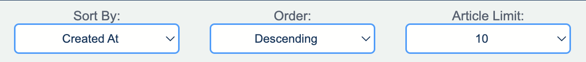

# Northcoders News Front-End

#### I am currently working on:

-Voting on comments
 
-Posting an article
 
-Accessible design
 
-User validation for logging in

#### To access the app, follow this URL:

> https://bm-nc-news.netlify.app/

## Skills

- **JavaScript**
- **React.js**
- **React Routers**
- **State**
- **HTML**
- **CSS**
- **Axios**
- **Lottie**
- **Error-Handling**
- **Vite**
- **Controlled Components**
- **Conditional Rendering**
- **Hosting**
- **Pagination**
- **Responsive Design**
- **Accessible Design**
- **Optimistic Rendering**

## Setup

#### Clone the repository:

> Click the green `Code` button and copy the URL  

#### In your local machine's terminal, run:

> git clone https://github.com/Dimeben/nc-news-front-end.git  

#### Once it has downloaded, run:

> cd /nc-news-front-end  
> code .  

#### Install npm & Node.js by following this link:

[Install npm and Node.js](https://docs.npmjs.com/downloading-and-installing-node-js-and-npm)

> Made using Node.js v22.4.1

#### Install the dependencies by running the following in your terminal:

> npm i

#### Setup the local host using Vite:

> npm run dev

#### Then click on the link that looks like:

> http://localhost:5173/

#### To end the hosting of the app:

> ctrl + c

## Journey & Features

This is a front end app which makes API calls to my back end project:

> https://github.com/Dimeben/nc-news

Using JavaScript, React, HTML & CSS, I have built a dynamic news aggregation app.
 
 
I began by planning a wire frame and considered user stories - how would someone interact with the app?
 
 

 
 
Once the plan was complete, I enabled Cross Origin Resource Sharing on my API. This was to prevent any errors which may have arisen.
 
 
I started my app by working through the basic functionality. I used React Router to create different paths and separated my components. In my api.js file, I used Axios to create the requests to my API - these used the CRUD operations.
 
 

 
 
Throughout development, I utilised State to efficiently render my app. This helped me implement loading features as well as store the data received from my API calls.
 
 
At the top of the app, you will notice a parameters bar. This allows for users to filter all of the articles based on selected parameters.
 
 

 
 
At the bottom of the screen is a navigation bar. Clicking on one of the options will take you to the relevant page.
 
 

 
 
Clicking on an article will take you to that article's page. On this page, you will find more information about the article, including the main body and the related comments. Users have the ability to post their own comments and give or take away votes. The newly posted comment will render optimistically.
 
 

---

This portfolio project was created as part of a Digital Skills Bootcamp in Software Engineering provided by [Northcoders](https://northcoders.com/)
